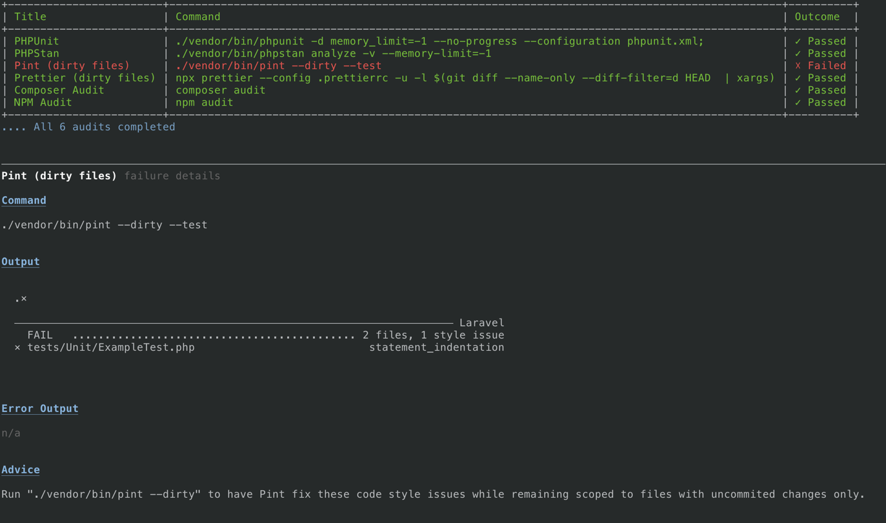

# Dev Audit 

[](https://packagist.org/packages/:vendor_slug/:package_slug)
[](https://github.com/:vendor_slug/:package_slug/actions?query=workflow%3Arun-tests+branch%3Amain)
[](https://github.com/:vendor_slug/:package_slug/actions?query=workflow%3A"Fix+PHP+code+style+issues"+branch%3Amain)
[](https://packagist.org/packages/:vendor_slug/:package_slug)

This package provides a Laravel console command to quickly run a set of CLI commands and summarize their outcome.

Dev Audit is intended to encapsulate a series of audits regularly run together as part of a development process, such as a pre-merge routine.

The package ships with an opinionated set of default audits based upon the author's workflow but is easily modified to suit yours instead.

Out of the box, Dev Audit runs:

- Tests (phpunit)
- Static Analysis (phpstan)
- Lint check against changed PHP files (pint)
- Lint check against changed javascript files (prettier)
- Composer audit
- Npm audit

Once installed, Dev Audit can be run at any time using `artisan dev:audit`.

Under the hood, Dev Audit executes the commands from the configuration via an instance of `Symfony/Process` and serves as a UI wrapper to summarize the results while removing feedback clutter.

Typical output looks something like this:



## Installation

To get started, you need only to install the package via composer:

It is recommended to only require the package for development.

```bash
composer require --dev jamesclark32/dev-audit
```

Once installed, Dev Audit can be run at any time using `artisan dev:audit`.

## Configuration

To adjust the audits to be run, simply publish and modify the config file. 

You can publish the config file to `config/dev-audit.php` with:

```bash
php artisan vendor:publish --tag="dev-audit-config"
```

The config files contains the details of the audits to run. Audits can be added, removed, modified, or have their order adjusted.

Any new audits need only a `title` for display purposes and the `command` to run.

`failure_hint` content is optional, but provides the opportunity to display commands needed for likely next steps in the case of a failure.

The default audit configuration looks like this:

```php
return [
     'audits' => [
        [
            'title' => 'PHPUnit',
            'command' => './vendor/bin/phpunit -d memory_limit=-1 --no-progress --configuration phpunit.xml;',
            'failure_hint' => 'Run tests using "php artisan test --stop-on-error" to help discover code issues in isolation.',
        ],
        [
            'title' => 'PHPStan',
            'command' => './vendor/bin/phpstan analyze -v --memory-limit=-1',
            'failure_hint' => 'Address the code issues found by "./vendor/bin/phpstan analyze -v --memory-limit=-1", or adjust phpstan.neon to allow for them.',
        ],
        [
            'title' => 'Pint (dirty files)',
            'command' => './vendor/bin/pint --dirty --test',
            'failure_hint' => 'Run "./vendor/bin/pint --dirty" to have Pint fix these code style issues while remaining scoped to files with uncommited changes only.',
        ],
        [
            'title' => 'Prettier (dirty files)',
            'command' => 'npx prettier --config .prettierrc -u -l $(git diff --name-only --diff-filter=d HEAD  | xargs)',
            'failure_hint' => 'Run "npx prettier --config .prettierrc -u -w $(git diff --name-only --diff-filter=d HEAD  | xargs)" to have prettier fix these code style issues while remaining scoped to files with uncommited changes only.',
        ],
        [
            'title' => 'Composer Audit',
            'command' => 'composer audit',
        ],
        [
            'title' => 'NPM Audit',
            'command' => 'npm audit',
        ],
    ],
];
```

## Changelog

Please see [CHANGELOG](CHANGELOG.md) for more information on what has changed recently.

## Credits

- [James Clark](https://github.com/Jamesclark32)

## License

The MIT License (MIT). Please see [License File](LICENSE.md) for more information.
